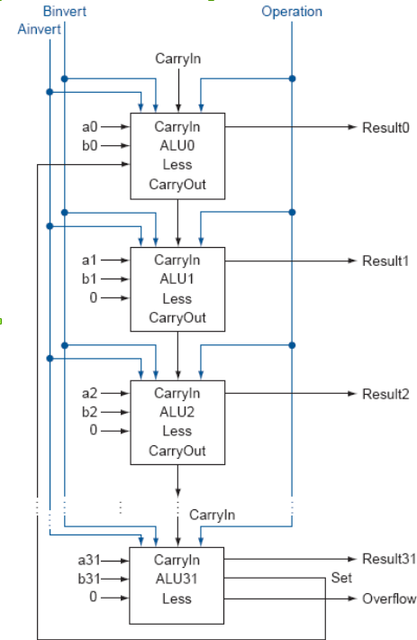

# ALU

## Structure
The structure is a reprocess for the arguments, a midprocessor to combine the transformed arguments, and a postprocessor to transform the outputs.
A left branch is a 'yes', and a right brangh is a 'no'.

## Test Bench

## Timing Analysis
