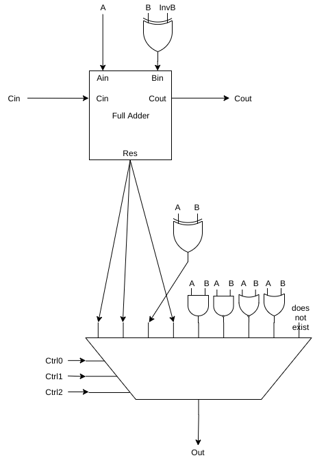
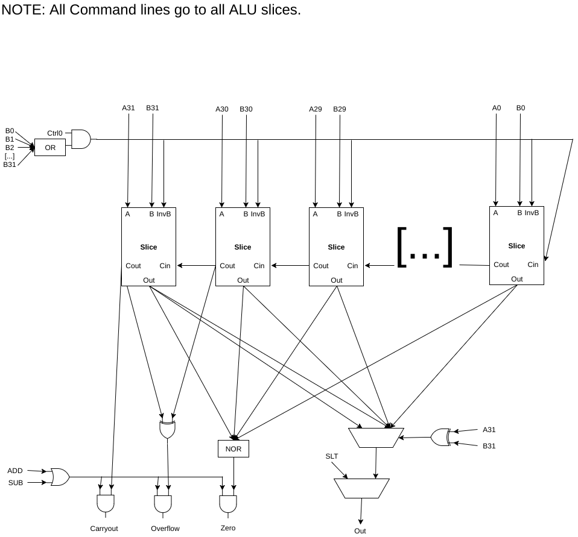
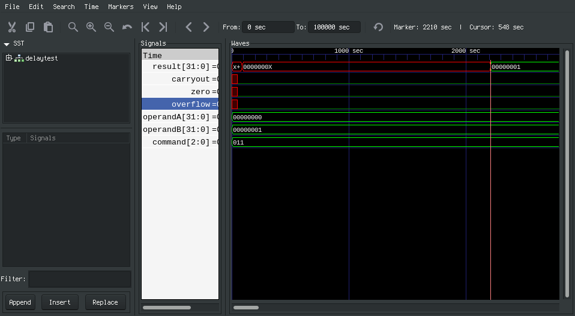
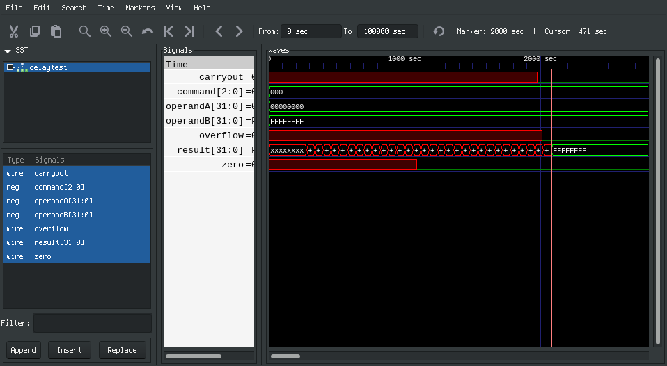
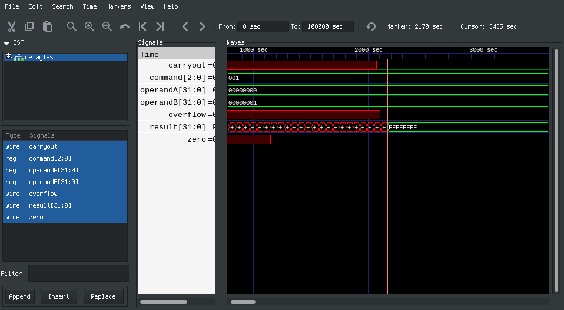
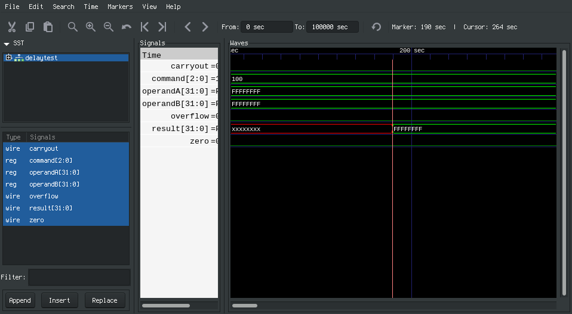
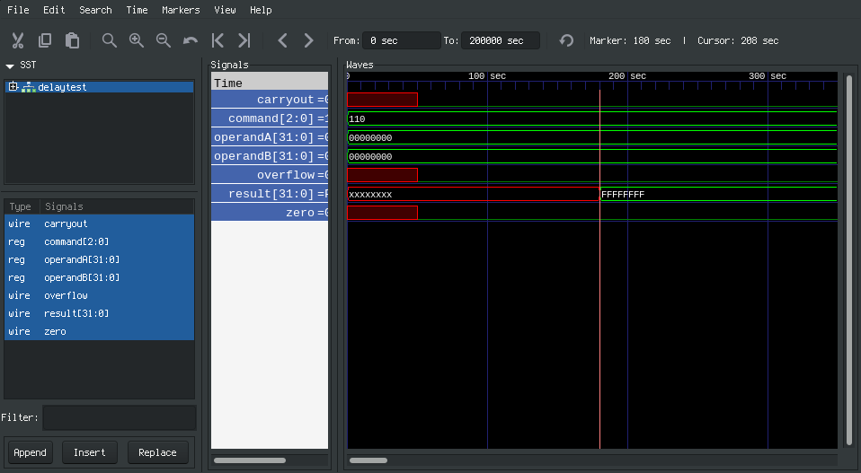

# ALU Report

Our ALU passes 196640 carefully controlled test cases to verify adherence to the MIPS specification.
The structural description of the components are well-documented so replication and iteration is easy.

# Design
The block design implements all of the commands except for SLT bit slices, using a carry input and an invert b input to carryout subtraction.
There is also a zero input and zero output.
The zero output simply ors the zero input with the result bit, resulting in a boolean reflecting if the sum so far is not zero.

The glue logic decides if operandB should be inverted.
Since this is only necessary for a subtraction or SLT operation, the initial carry in is the same as the invert b input.
Notably, invert b is 0 when b is zero and we are subtracting.
This is because subtracting zero via inversion and an extra carry results in an extraneous overall carry bit.
This is illustrated with a large or gate two images down., as this is logically equivalent with our timing model and less messy to draw.
A single slice is pictured below.

The overflow is detected by going by the signs of a and b if possible, and the sign of the subtraction otherwise.
This eliminates the danger of overflow.
At the end, the flags are anded with a boolean reflecting whether or not the command corresponds to addition or subtraction.
The block diagram is pictured below

Our original design handled zero with a postprocessor similar to SLT, and only implemented nand, nor, and add using a 4-way mux in each bit slice.
Xor was implemented by disabling the carry in and using addition, and and and or were implemented using invert a and invert b inputs.
However, since the carry bit is what stops the slices from operating completely in parallel, we expanded to an 8-way mux per slice and passing carry directly from the input, through the fulladder, and to the output.
With room for and and or, there was no longer any  need to invert a.

We also initially missed the special case from subtracting zero.
Luckily, the test bench caught this and brought it to our attention.
We added a boolean reflecting if b was not zero and anded it with the existing condition for inverting b before passing the value to the alu slices.

Some logic was also simplified.
Since invert b does not affect and, or, nor, or nand, the condition for inverting be was simplified to be equal to the LSB of the command.

# Test Bench
- main test bench: testbench.cpp, ran with `make` and then `./obj_dir/Valu`
- delay visualized: delay.sv, ran with `iverilog delay.sv`, `./a.out`, and `gtkwave test.vcd`

The main principle of the test bench is to thoroughly check addition.
Negating the second test case element gives the same coverage for subtraction.
The addition test cases are created by specifying whether or not each input and sum is nonnegative.
This consequently tests carrying, as carrying only happens when a negative and positive number are added to create a positive number or both operands are negative.
Overflows can also be tested by specifying both inputs as the same sign and the sum as the opposite signs.

The bit-wise operators are checked on the same test cases, as there is a good amount of entropy already in the generated test cases and other edge cases are tested later.
There is also another set of generated cases for when the addition is 0, testing the zero flag.
However, this checks the ALU's output to its zero flag.
For a problem here to be detected, the ALU's other functions must be properly fixed.
This is a feature as the designer will not try to fix a perfectly good zero flag prematurely.
The zero flag also tests an edge case of SLT, as zero draws the line between less than or less than or equal to via subtraction.
The overflow flag is also tested by generating cases where the sum is the maximum or minimum number before overflowing.

The testing loop iterates over all 8 configurations for the addition test case generator, 1024 random instances of each test case spec, and all 8 functions.
For all of the above cases, an overflow test and zero test are also tested, leading to 3 * 8 * 1024 * 8 test cases.
The covered output cases are calculated below and demonstrate excellent coverage.

| Flag     | Intentionally False | Intentionally True |
|----------|---------------------|--------------------|
| Overflow | 192512              | 4096               |
| Carry    | 188416              | 8192               |
| Zero     | 163852              | 16388              |

Along with this table, all combinations of 0, -1, and the upper and lower limits of the inputs are tested as well for all operations to test edge cases.
XOR, NOR, NAND, AND, OR, and SLT get to shine especially here, as the controlled presence of 1s and 0s in the bits make for distinct outputs.
For example, -1 XOR 0 is -1, everything AND 0 is 0, everything NOR 1 is zero, and everything NAND 0 is 1.
If the second argument of SLT is the lower limit of a 32 bit signed int, SLT must output 0.

# Timing

Because SLT is addition/subtraction with logic at the end, it is the slowest operation.
Since all the intermediate carry bits are processed with or gates, a case with no carrying will avoid short circuiting behavior.
Therefore, the slowest operation is SLT with a delay of 2210.

The worst case addition follows the same principle, 0 plus -1 has a delay of 2080 nanoseconds, as shown below.

Applying the same principle, subtraction has a worst case of 0 - 1 with delay 2170 nanoseconds.

The XOR is completely parallel and exhibits no short circuiting behavior.
Therefore, all inputs will have the same delay of 190.

The AND is completely parallel and exhibits short circuiting behavior, so to be safe avoid this by using only 1s with -1 & -1.
The worst case AND is 190 nanoseconds.

The NAND gate is similar to AND, so testing with ~(-1 & -1), a delay of 10 less is expected and demonstrated at 180 nanosecons.

The NOR gate short circuits if any input is 1, so testing with ~(0 | 0), a delay of 180 nanoseconds is observed expectedly similar to NAND.

The OR gate is expected to and demonstrates the same propagation delay as AND: 190 nanoseconds.

# Conclusion

Our ALU balances size and speed and is correct.
Therefore, it is ready to be built into a CPU.

# Work Plan Reflection

The lab took longer than expected.
This is due to not taking the time to discuss the design of the ALU, the person writing the verilog had to rewrite it many times and the others were in the dark on the design and could not begin their tasks until the ALU was finished.
We expected to get this done in 3 meetings with a few hours in between.
This took 4 times with too many hours in between, with most of us having done nothing the first 2 meetings.
