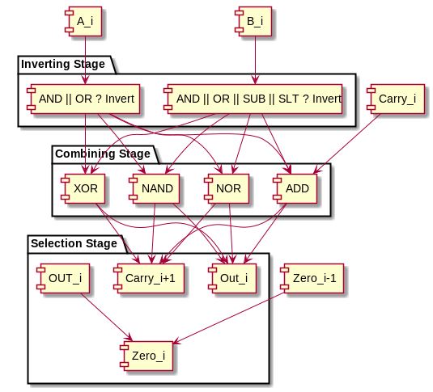

# ALU Report

Our ALU passes 196640 carefully controlled test cases to verify adherence to the MIPS specification.
The structural description of the components are well-documented so replication and iteration is easy.

# Design
The block design implements only NOR, XOR, XOR, and ADD in bit slices, using a carry input as well as not gates to get the other 4 functions with little area or timing cost.
The least significant ALU bit slice sets the adder's carry bit to whether or not a subtraction operation must happen.

The middle ALU slices then take the raw carry from the previous ALU, as well as applying and between the last zero output and the current result to output a new OR, to be inverted after the last bit.

The last ALU is identical to the above, except the carry in and carry out are compared to create an additional overflow output.
The zero flag is also inverted so that 1 indicates zero and 0 indicates a nonzero output.
A postprocessor is then ran on the outputs and the raw inputs to deduce SLT, as well as setting carry and overflow to zero when addition or subtraction is not used.

Our original design handled zero with a postprocessor similar to SLT.
However, we realized that zero could be calculated with the bit-wise ALU model.
Since this fit our core bit-wise design model without adding to area or delay, we decided to have the bit-wise ALU units to handle zero.

Implementing SLT in a bit-wise model by implementing a bit-wise greater-than-or-equal-to may have been possible.
However, if the signs of the inputs are different that cascade can be bypassed with a simple XOR on the MSB of the inputs.
Therefore, we kept SLT as a separate unit.

# Test Bench

The main principle of the test bench is to thoroughly check addition.
Negating the second test case element gives the same coverage for subtraction.
The addition test cases are created by specifying whether or not each input and sum is nonnegative.
This consequently tests carrying, as carrying only happens when a negative and positive number are added to create a positive number or both operands are negative.
Overflows can also be tested by specifying both inputs as the same sign and the sum as the opposite signs.

The bit-wise operators are checked on the same test cases, as there is a good amount of entropy already in the generated test cases and other edge cases are tested later.
There is also another set of generated cases for when the addition is 0, testing the zero flag.
However, this checks the ALU's output to its zero flag.
For a problem here to be detected, the ALU's other functions must be properly fixed.
This is a feature as the designer will not try to fix a perfectly good zero flag prematurely.
The zero flag also tests an edge case of SLT, as zero draws the line between less than or less than or equal to via subtraction.
The overflow flag is also tested by generating cases where the sum is the maximum or minimum number before overflowing.

The testing loop iterates over all 8 configurations for the addition test case generator, 1024 random instances of each test case spec, and all 8 functions.
For all of the above cases, an overflow test and zero test are also tested, leading to 3 * 8 * 1024 * 8 test cases.
The covered output cases are calculated below and demonstrate good coverage.

| Flag     | Intentionally False | Intentionally True |
|----------|---------------------|--------------------|
| Overflow | 192512              | 4096               |
| Carry    | 188416              | 8192               |
| Zero     | 44032               | 16384              |

Along with this table, all combinations of 0, -1, and the upper and lower limits of the inputs are tested as well for all operations to test edge cases.
XOR, NOR, NAND, AND, OR, and SLT get to shine especially here, as the controlled presence of 1s and 0s in the bits make for distinct outputs.
For example, -1 XOR 0 is -1, everything AND 0 is 0, everything NOR 1 is zero, and everything NAND 0 is 1.
If the second argument of SLT is the lower limit of a 32 bit signed int, SLT must output 0.
